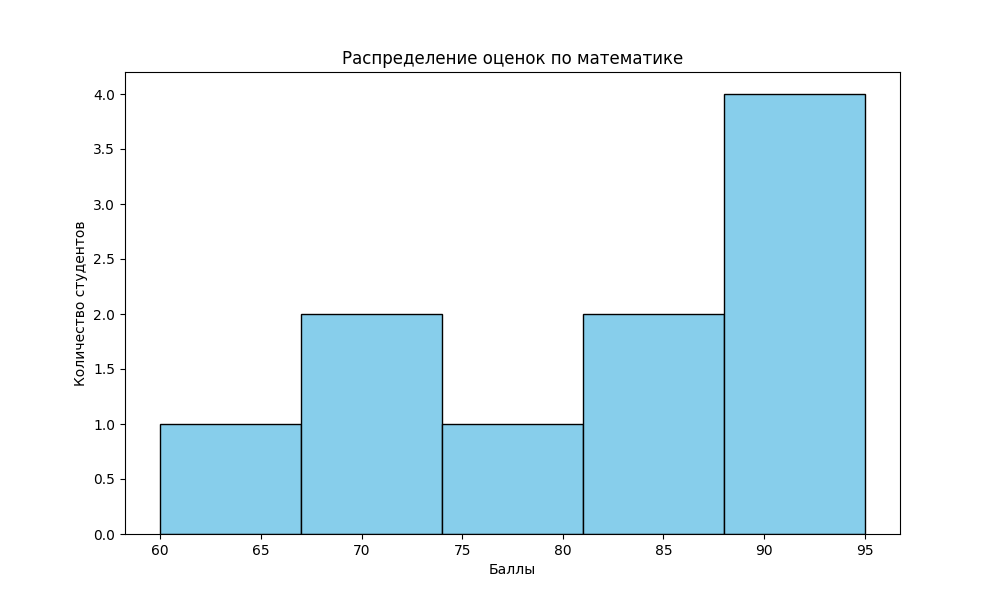
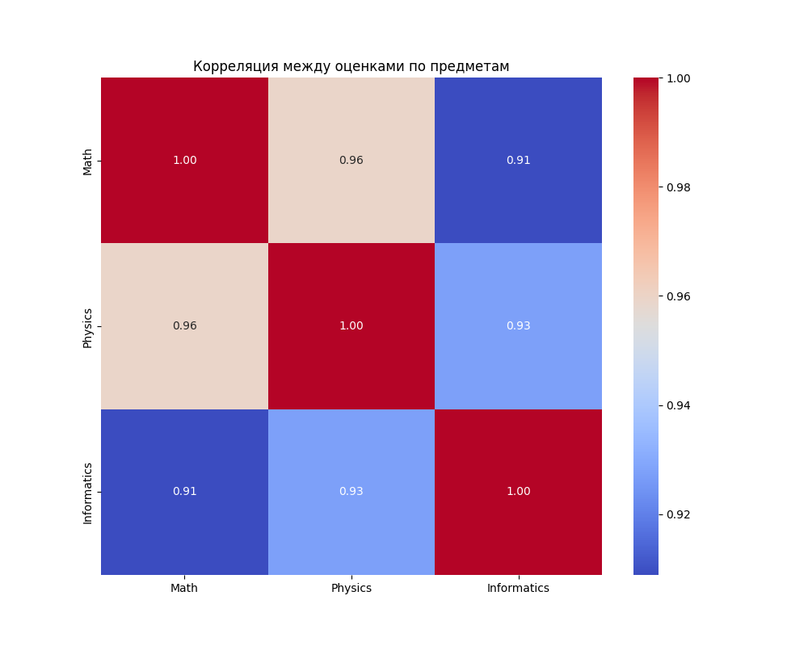
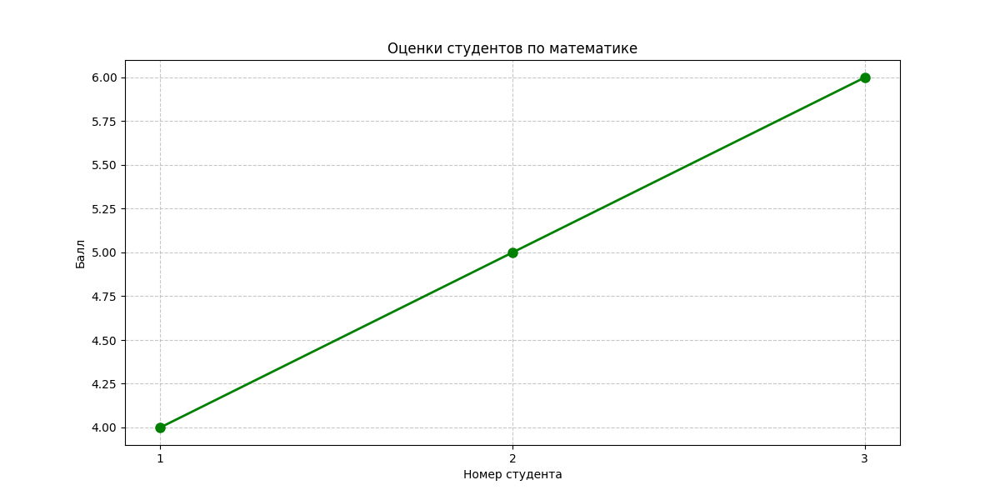

# Лабораторная работа №2: Основы NumPy

## 1. Цель работы
Изучение библиотеки NumPy для научных вычислений, реализация векторных и матричных операций, а также базовый статистический анализ и визуализация данных

## 2. Ход выполнения
В рамках работы был написан код в `main.py`, реализующий следующие задачи:  
1.  **Работа с массивами**: Генерация векторов и матриц, изменение их формы и транспонирование  
2.  **Линейная алгебра**: Реализация операций сложения, скалярного произведения, умножения матриц и решения систем линейных уравнений (СЛАУ)  
3.  **Анализ данных**: Загрузка датасета из CSV, расчет статистических метрик и нормализация данных  
4.  **Визуализация**: Построение графиков с использованием библиотек `matplotlib` и `seaborn`.  

Весь код покрыт модульными тестами, документирован и типизирован

## 3. Нюансы реализации
*   **Векторизация**: Для повышения производительности исключены циклы for. Все математические операции выполняются над массивами целиком, используя оптимизированные C-функции NumPy.
*   **Типизация данных**: Особое внимание уделено приведению типов `numpy.float64` к стандартному `float` для строгого соответствия аннотациям типов.
*   **Обработка исключений**: При нормализации данных учтены граничные случаи (например, деление на ноль, если все элементы массива равны).

## 4. Результаты визуализации

### Гистограмма распределения оценок

### Тепловая карта корреляции предметов

### График успеваемости

## 5. Вывод
В ходе лабораторной работы освоены методы эффективной обработки многомерных массивов. Реализованный функционал позволяет проводить первичный анализ данных и решать задачи линейной алгебры без использования медленных циклических конструкций Python.